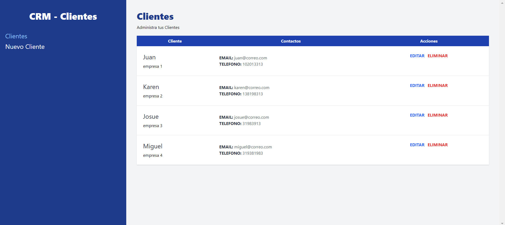

# cmr-app-react-router-dom-json-server-tailwindcss

# Introduction to CRM App for Client Management

CRM App Logo (Replace 'link-to-logo.png' with the actual URL or path to your CRM App's logo)

The CRM App for Client Management is a powerful web application built using React, React Router DOM, Tailwind CSS, and JSON Server. This app provides a seamless and user-friendly solution for efficiently managing and organizing client data and enhancing overall productivity for businesses and organizations.

Tech Stack:

Frontend: React, React Router DOM, Tailwind CSS
Backend: JSON Server
